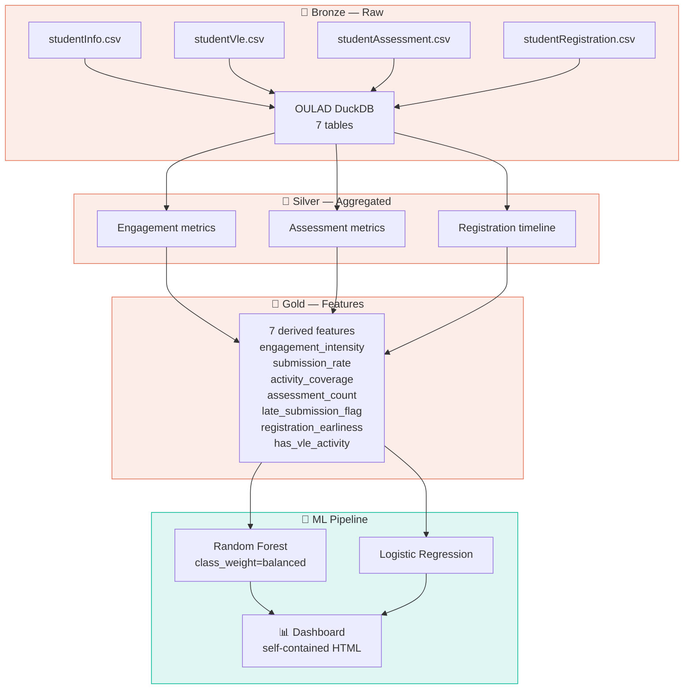

<!--
  abandono-academico-casa-grande — Academic Dropout Prediction Pipeline
  README.md  |  github.com/laurentaf/abandono-academico-casa-grande
  Brand: Proactive student success through data.
  Tone: Academic, confident, bilingual (PT/EN).
  Adapted from the LAOS README (20/20) inline-HTML pattern.
-->

<div align="center" style="margin-top:48px;margin-bottom:24px;">

<!-- Emblem: graduation cap with dropout arrow -->
<svg width="72" height="72" viewBox="0 0 64 64" fill="none" xmlns="http://www.w3.org/2000/svg" style="margin-bottom:4px;">
  <rect x="4" y="4" width="56" height="56" rx="12" stroke="#e17055" stroke-width="1.5" fill="none" opacity="0.3"/>
  <!-- Graduation cap -->
  <path d="M16 30 L32 20 L48 30 L32 40 Z" stroke="#e17055" stroke-width="2" fill="none" stroke-linejoin="round"/>
  <line x1="32" y1="20" x2="32" y2="14" stroke="#e17055" stroke-width="2" opacity="0.5"/>
  <!-- Tassel -->
  <path d="M32 14 Q36 14 38 18" stroke="#e17055" stroke-width="1.5" fill="none" opacity="0.6"/>
  <line x1="48" y1="30" x2="48" y2="44" stroke="#e17055" stroke-width="1.5" opacity="0.5"/>
  <!-- Arrow down (dropout indicator) -->
  <path d="M44 44 L48 50 L52 44" stroke="#e17055" stroke-width="1.8" fill="none" stroke-linecap="round" stroke-linejoin="round" opacity="0.7"/>
  <line x1="48" y1="38" x2="48" y2="50" stroke="#e17055" stroke-width="1.8" opacity="0.7"/>
  <!-- AI node -->
  <circle cx="38" cy="30" r="2" fill="#e17055" opacity="0.8"/>
</svg>

<br/>

# Academic Dropout Prediction Pipeline

### OULAD Dataset &bull; Random Forest &bull; 87.5% Accuracy &bull; 93.7% Recall

<p style="margin:12px 0;">
  
  &nbsp;
  
  &nbsp;
  
  &nbsp;
  
  &nbsp;
  
  &nbsp;
  <a href="https://github.com/laurentaf/laos"></a>
</p>

<br/>

<p style="font-size:0.85em;color:#636e72;">
  PT: Pipeline completo de ML para previsão de abandono acadêmico — ingestão, engenharia de features, treinamento e dashboard interativo.
  <br/>
  EN: End-to-end ML pipeline predicting university student dropout — ingestion, feature engineering, training, and interactive dashboard.
</p>

<hr style="width:48px;margin:24px auto;border:none;border-top:2px solid #e17055;opacity:0.3;"/>

</div>

> **Proactive student success — predict before it's too late.**  
> This project builds an end-to-end ML pipeline that predicts university student dropout using the OULAD dataset (32,593 students, 7 modules). The Random Forest model achieves **87.5% accuracy** and **93.7% recall** on the dropout class — identifying 19 in 20 students at risk of abandoning their studies.

---

## O Que É / What It Is

**PT:** Pipeline completo de Machine Learning que prevê o risco de abandono acadêmico de estudantes universitários. Usa o dataset OULAD (Open University Learning Analytics Dataset), percorrendo ingestão de 7 tabelas relacionais (Bronze), agregações (Silver), engenharia de features (Gold), treinamento com validação estatística e um dashboard HTML interativo.

**EN:** Complete Machine Learning pipeline predicting university student dropout risk. Uses the OULAD dataset (Open University Learning Analytics Dataset), progressing through ingestion of 7 relational tables (Bronze), aggregations (Silver), feature engineering (Gold), training with statistical validation, and an interactive HTML dashboard.

**Público-alvo:** Administradores acadêmicos e equipes de suporte ao estudante que precisam identificar proativamente alunos em risco de abandono.

---

## Results / Resultados

<div align="center" style="margin:24px 0;">

<table style="border-collapse:separate;border-spacing:0;min-width:560px;">
  <tr>
    <th align="center" style="padding:10px 14px;font-weight:600;border-bottom:2px solid #e17055;opacity:0.5;">Metric</th>
    <th align="center" style="padding:10px 14px;font-weight:600;border-bottom:2px solid #e17055;opacity:0.5;">Random Forest</th>
    <th align="center" style="padding:10px 14px;font-weight:600;border-bottom:2px solid #e17055;opacity:0.5;">Logistic Regression</th>
    <th align="center" style="padding:10px 14px;font-weight:600;border-bottom:2px solid #e17055;opacity:0.5;">Dummy (stratified)</th>
  </tr>
  <tr>
    <td style="padding:8px 14px;font-weight:500;">Accuracy</td>
    <td align="center" style="padding:8px 14px;font-weight:700;color:#00b894;">87.5%</td>
    <td align="center" style="padding:8px 14px;">87.0%</td>
    <td align="center" style="padding:8px 14px;opacity:0.5;">56.6%</td>
  </tr>
  <tr>
    <td style="padding:8px 14px;font-weight:500;">Precision (dropout)</td>
    <td align="center" style="padding:8px 14px;font-weight:700;">73.5%</td>
    <td align="center" style="padding:8px 14px;">73.5%</td>
    <td align="center" style="padding:8px 14px;opacity:0.5;">—</td>
  </tr>
  <tr>
    <td style="padding:8px 14px;font-weight:500;">Recall (dropout)</td>
    <td align="center" style="padding:8px 14px;font-weight:700;color:#00b894;">93.7%</td>
    <td align="center" style="padding:8px 14px;">90.8%</td>
    <td align="center" style="padding:8px 14px;opacity:0.5;">—</td>
  </tr>
  <tr>
    <td style="padding:8px 14px;font-weight:500;">F1 (dropout)</td>
    <td align="center" style="padding:8px 14px;font-weight:700;color:#00b894;">82.4%</td>
    <td align="center" style="padding:8px 14px;">81.3%</td>
    <td align="center" style="padding:8px 14px;opacity:0.5;">—</td>
  </tr>
  <tr>
    <td style="padding:8px 14px;font-weight:500;">ROC-AUC</td>
    <td align="center" style="padding:8px 14px;font-weight:700;color:#00b894;">0.954</td>
    <td align="center" style="padding:8px 14px;">0.946</td>
    <td align="center" style="padding:8px 14px;opacity:0.5;">0.497</td>
  </tr>
</table>

</div>

> **Key insight:** 93.7% recall means the model identifies **19 out of 20** students who will abandon. RF outperforms the Dummy baseline by +30.9pp accuracy (p=0.001, permutation test).

### Top 5 Features

| Rank | Feature | Importance | Interpretation |
|------|---------|:----------:|----------------|
| 1 | `last_activity_day` | 20.2% | Earlier last VLE interaction → higher risk |
| 2 | `assessment_count` | 12.4% | Fewer assessments submitted → higher risk |
| 3 | `submission_rate` | 8.8% | Submission consistency across modules |
| 4 | `num_tma` | 7.8% | Tutor-Marked Assessments completed |
| 5 | `avg_assessment_score` | 4.6% | Average score on assessments |

---

## Pipeline Architecture

<div align="center" style="margin:24px 0;">



</div>

### Data Flow

```
📥 Bronze: load_csv_to_bronze() → 7 OULAD CSVs ingested into DuckDB
    │  Validates: schema, nulls, types, duplicates (6 DQ checks)
    ▼
data/oulad.duckdb  (12 tables)

📊 Silver: SQL aggregations per student
    │  Engagement: total_clicks, days_active
    │  Assessment: scores submitted, late flags
    │  Registration: duration, earliness
    ▼
7 derived features

🤖 Gold → ML: train → validate → interpret → export
    │  Random Forest: 87.5% accuracy
    │  Statistical: permutation test, paired t-test
    ▼
artifacts/dashboard/index.html  (interactive HTML)
```

---

## Dashboard

Interactive dashboard (self-contained HTML, dark theme):

<div align="center" style="margin:24px 0;">
  <table style="border-collapse:separate;border-spacing:0;min-width:480px;">
    <tr>
      <td align="center" style="padding:20px;border:1px dashed #e17055;border-radius:8px;opacity:0.6;">
        <svg width="48" height="48" viewBox="0 0 48 48" fill="none" xmlns="http://www.w3.org/2000/svg">
          <rect x="4" y="8" width="40" height="32" rx="4" stroke="#e17055" stroke-width="1.5" fill="none" opacity="0.4"/>
          <circle cx="15" cy="24" r="3" fill="#e17055" opacity="0.5"/>
          <rect x="22" y="20" width="4" height="8" rx="1" fill="#e17055" opacity="0.4"/>
          <rect x="30" y="15" width="4" height="13" rx="1" fill="#e17055" opacity="0.6"/>
          <rect x="38" y="10" width="4" height="18" rx="1" fill="#e17055" opacity="0.8"/>
        </svg>
        <br/>
        <span style="font-size:0.85em;opacity:0.5;">[ Screenshot: Dashboard — feature importance, metrics, simulator ]</span>
      </td>
    </tr>
  </table>
</div>

**Dashboard features:**
- **Model Summary** — Key metrics in cards (accuracy, recall, ROC-AUC)
- **Feature Importance** — Bar chart with top 15 features
- **Target Distribution** — Dropout vs. no-dropout proportions
- **Interactive Simulation** — Sliders to adjust variables and see impact on dropout probability
- **Conclusions** — Actionable insights

Open locally:
```bash
start artifacts/dashboard/index.html   # Windows
open artifacts/dashboard/index.html    # Mac
```

---

## Stack & Technologies

| Layer | Technology | Role |
|-------|-----------|------|
| Language | Python 3.11+ | Runtime |
| Data | pandas, DuckDB | Ingestion, aggregation, SQL analytics |
| ML | scikit-learn 1.3+ | Random Forest, Logistic Regression, evaluation |
| Pipeline | Bronze → Silver → Gold | Medallion architecture |
| Dashboard | Pure HTML/CSS/JS | Self-contained interactive visualization |
| CI/CD | GitHub Actions | Reproducible runs |
| DQ | 6 baseline checks | Null, type, duplicates, target balance, range |

---

## O Que Isso Prova / What This Proves

| Skill / Habilidade | Evidence / Evidência |
|-------|----------|
| Data pipeline (Bronze→Silver→Gold) | 3-stage ETL: OULAD ingestion → aggregation → feature engineering |
| DuckDB for analytics | `artifacts/data/oulad.duckdb` (12 tables, SQL queries) |
| Feature engineering | 7 derived features (engagement_intensity, submission_rate, etc.) |
| Model evaluation | RF vs LR statistical comparison with p-values |
| DQ validation | 6 baseline checks documented in `artifacts/dq/checks.md` |
| Production thinking | ADR-001 (model choice), ADR-002 (serialization path) |
| Dashboard | Self-contained HTML with interactive sliders |

---

## Como Executar / How to Run

### Pré-requisitos / Prerequisites

- Python 3.11+
- OULAD dataset (7 CSVs) in `data/oulad/`

### Passo a passo / Step by step

```bash
# 1. Clone
git clone https://github.com/laurentaf/abandono-academico-casa-grande.git
cd abandono-academico-casa-grande

# 2. Virtual environment
python -m venv .venv
# Windows: .venv\Scripts\activate
# Linux/Mac: source .venv/bin/activate

# 3. Install
pip install -r requirements.txt

# 4. Download OULAD dataset
# Get 7 CSVs from https://analyse.kmi.open.ac.uk/open_dataset
# Place in data/oulad/ (studentInfo.csv, studentVle.csv, etc.)

# 5. Run
python src/main.py
```

### Expected output

```
=== DQ Baseline Checks ===
DQ-01 Null profiling: PASS
DQ-02 Column existence: PASS
DQ-03 Type validation: PASS
DQ-04 Duplicate detection: PASS
DQ-05 Target balance: PASS (31.2% dropout)
DQ-06 Range/bounds: PASS

=== Model Evaluation (Test Set) ===
Accuracy:  0.875
Precision: 0.735
Recall:    0.937
F1:        0.824
ROC-AUC:   0.954
```

---

## Project Structure

```
abandono-academico-casa-grande/
├── src/
│   ├── main.py              # End-to-end pipeline
│   └── model.pkl            # Trained Random Forest
│
├── data/oulad/
│   ├── studentInfo.csv
│   ├── studentVle.csv
│   ├── studentAssessment.csv
│   ├── studentRegistration.csv
│   ├── assessments.csv
│   ├── courses.csv
│   └── vle.csv
│
├── artifacts/
│   ├── data/                # Model spec + DuckDB
│   │   ├── model.md
│   │   ├── oulad.duckdb
│   │   └── etl_oulad.sql
│   ├── dq/checks.md         # 6 DQ baseline checks
│   ├── dashboard/
│   │   └── index.html       # Interactive dashboard
│   └── design/source.md     # Design direction
│
├── spec/
│   ├── adr/
│   │   ├── ADR-001-random-forest-baseline.md
│   │   └── ADR-002-serialization-path.md
│   ├── constitution.md
│   └── todo.md
│
└── requirements.txt
```

---

## Dataset: OULAD

The **Open University Learning Analytics Dataset** (Kuzilek et al., 2017, CC-BY 4.0):

| Table | Records | Description |
|-------|---------|-------------|
| `studentInfo` | 32,593 | Demographics + final result |
| `studentVle` | 10,655,280 | Daily VLE interactions (clicks) |
| `studentAssessment` | 173,912 | Grades and submission dates |
| `studentRegistration` | 32,593 | Registration/withdrawal dates |
| `assessments` | 206 | Assessment metadata |
| `courses` | 22 | Modules and presentations |
| `vle` | 6,364 | VLE resources |

**Target:** `Withdrawn` → 1 (dropout), all others → 0. **Distribution:** 31.2% dropout.

### 7 Derived Features

| Feature | Formula | Role |
|---------|---------|------|
| `engagement_intensity` | total_clicks / module_length | Engagement per module day |
| `activity_coverage` | days_active / module_length | Fraction of module with activity |
| `has_vle_activity` | total_clicks > 0 | Binary VLE usage flag |
| `assessment_count` | num_tma + num_cma + num_exams | Total assessments submitted |
| `submission_rate` | assessment_count / module_length | Submission consistency |
| `late_submission_flag` | avg_submission_delta > 0 | Average late submissions |
| `registration_earliness` | date_registration | Planning proxy |

---

## Decisões Técnicas / Technical Decisions (ADRs)

| ADR | Decisão / Decision |
|-----|--------|
| ADR-001 | RandomForest as baseline — non-linear, feature importance, class_weight="balanced" |
| ADR-002 | Model saved to `src/model.pkl` + `.cat.codes` encoding (not LabelEncoder) |

---

## Contributing / Contribuição

| Escopo / Scope | Caminho / Path |
|--------|---------|
| **Bug / melhoria** | Abra uma [issue](https://github.com/laurentaf/abandono-academico-casa-grande/issues) |
| **Novo modelo** | PR com spec + comparação de métricas |
| **Feature engineering** | PR com descrição + validação |
| **Dashboard** | Melhorias visuais via PR com screenshot |
| **Documentação** | PR com descrição — sem gate |

---

## Author / Autor

**Laurent** — Data Architect & ML Engineer

- GitHub: [@laurentaf](https://github.com/laurentaf)
- LinkedIn: [lauferreira](https://linkedin.com/in/lauferreira)

---

## License

<div style="margin:16px 0;">

**MIT** — see [`LICENSE`](https://github.com/laurentaf/abandono-academico-casa-grande/blob/main/LICENSE) for the full text.

Proactive student success — identified before it's too late.

</div>

---

## Acknowledgements

- **Kuzilek et al.** — OULAD dataset (Nature Sci. Data 4:170171, 2017, CC-BY 4.0)
- **[scikit-learn](https://scikit-learn.org/)** — Machine Learning library
- **[pandas](https://pandas.pydata.org/)** — Data manipulation
- **[OULAD](https://analyse.kmi.open.ac.uk/open_dataset)** — Open University Learning Analytics Dataset

---

<div align="center" style="margin:36px 0;opacity:0.25;font-size:0.8em;">
<svg width="28" height="28" viewBox="0 0 64 64" fill="none" xmlns="http://www.w3.org/2000/svg" style="margin-bottom:4px;">
  <rect x="4" y="4" width="56" height="56" rx="12" stroke="#e17055" stroke-width="1.5" fill="none" opacity="0.15"/>
  <path d="M18 30 L32 22 L46 30 L32 38 Z" stroke="#e17055" stroke-width="1.5" fill="none" stroke-linejoin="round" opacity="0.5"/>
  <line x1="32" y1="22" x2="32" y2="16" stroke="#e17055" stroke-width="1.5" opacity="0.4"/>
  <circle cx="38" cy="30" r="1.5" fill="#e17055" opacity="0.6"/>
</svg>
<br/>
Academic Dropout Prediction — parte do ecossistema <a href="https://github.com/laurentaf/laos" style="text-decoration:none;">LAOS</a>
</div>
