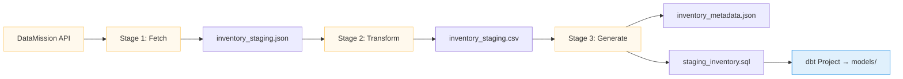

<!--
  Emanuella Stock Ingestion — Jewelry stock ingestion pipeline
  README.md  |  github.com/laurentaf/emanuella-stock-ingestion
  Brand: Inventory data you can trust.
  Tone: Friendly, practical, bilingual.
  Adapted from the LAOS README (20/20) inline-HTML pattern.
-->

<div align="center" style="margin-top:48px;margin-bottom:24px;">

<!-- Emblem: jewel / sparkle -->
<svg width="72" height="72" viewBox="0 0 64 64" fill="none" xmlns="http://www.w3.org/2000/svg" style="margin-bottom:4px;">
  <rect x="4" y="4" width="56" height="56" rx="12" stroke="#fdcb6e" stroke-width="1.5" fill="none" opacity="0.3"/>
  <!-- Diamond shape -->
  <polygon points="32,10 44,30 32,54 20,30" stroke="#fdcb6e" stroke-width="2" fill="none"/>
  <polygon points="32,10 44,30 32,54 20,30" stroke="#fdcb6e" stroke-width="6" fill="none" opacity="0.1"/>
  <line x1="32" y1="10" x2="32" y2="54" stroke="#fdcb6e" stroke-width="0.8" opacity="0.3"/>
  <line x1="20" y1="30" x2="44" y2="30" stroke="#fdcb6e" stroke-width="0.8" opacity="0.3"/>
  <!-- Sparkle dots -->
  <circle cx="14" cy="16" r="1.5" fill="#fdcb6e" opacity="0.6"/>
  <circle cx="50" cy="14" r="1.5" fill="#fdcb6e" opacity="0.6"/>
  <circle cx="52" cy="44" r="1.5" fill="#fdcb6e" opacity="0.6"/>
</svg>

<br/>

# Emanuella Stock Ingestion

<p style="margin:12px 0;">
  
  &nbsp;
  
  &nbsp;
  
  &nbsp;
  
  &nbsp;
  <a href="https://github.com/laurentaf/laos"></a>
</p>

<br/>

### Inventory Pipeline &bull; Weekly Forecast &bull; dbt-Ready

<p style="font-size:0.85em;color:#636e72;">
  EN: Weekly inventory ingestion pipeline for Lojas Emanuella — fetch, transform, generate dbt artifacts.
  <br/>
  PT: Pipeline semanal de ingestão de estoque para Lojas Emanuella — API → transformação → artefatos dbt.
</p>

<hr style="width:48px;margin:24px auto;border:none;border-top:2px solid #fdcb6e;opacity:0.3;"/>

</div>

> **Inventory data you can trust — every week, automatically.**  
> Emanuella Stock Ingestion is a 3-stage ETL pipeline that fetches weekly inventory data from the DataMission API, transforms it into a clean staging CSV, and generates a commented dbt staging model ready to drop into your dbt project.

---

## O que é

Pipeline de ingestão de inventário semanal para **Lojas Emanuella** (joalheria). Consome dados da API DataMission, aplica transformações pandas e gera artefatos prontos para dbt.

**Por que existe:** Inventário de joalheria muda toda semana. Este pipeline automatiza a coleta e preparação dos dados, eliminando planilhas manuais e garantindo que o time de dados sempre comece com dados confiáveis.

**O que prova:** Ingestão via API REST, transformação pandas, modelagem dbt, agendamento CI/CD (GitHub Actions).

---

## Arquitetura



<div align="center" style="margin:24px 0;">

<table style="border-collapse:separate;border-spacing:0;min-width:480px;">
  <tr>
    <td colspan="3" align="center" style="padding:0 0 8px 0;">
      <div style="display:inline-block;border:1.5px solid #fdcb6e;border-radius:8px;padding:12px 24px;text-align:center;">
        <div style="font-weight:700;font-size:1em;letter-spacing:0.04em;color:#d4a017;">3-Stage ETL Pipeline</div>
        <div style="font-size:0.8em;opacity:0.5;">Python · pandas · requests · dbt</div>
      </div>
    </td>
  </tr>
  <tr><td colspan="3" align="center" style="padding:0;"><div style="width:1.5px;height:14px;background:#fdcb6e;opacity:0.2;margin:0 auto;"></div></td></tr>
  <tr>
    <td align="center" style="padding:0 8px;width:33%;">
      <div style="border:1px solid #fdcb6e;border-radius:6px;padding:8px 14px;text-align:center;">
        <div style="font-weight:600;font-size:0.85em;letter-spacing:0.02em;">Stage 1</div>
        <div style="font-size:0.7em;opacity:0.5;">Fetch from API<br/><code>fetch_inventory_data()</code></div>
      </div>
    </td>
    <td align="center" style="padding:0 8px;width:33%;">
      <div style="border:1px solid #fdcb6e;border-radius:6px;padding:8px 14px;text-align:center;">
        <div style="font-weight:600;font-size:0.85em;letter-spacing:0.02em;">Stage 2</div>
        <div style="font-size:0.7em;opacity:0.5;">Transform to CSV<br/><code>transform_inventory()</code></div>
      </div>
    </td>
    <td align="center" style="padding:0 8px;width:33%;">
      <div style="border:1px solid #0984e3;border-radius:6px;padding:8px 14px;text-align:center;">
        <div style="font-weight:600;font-size:0.85em;letter-spacing:0.02em;">Stage 3</div>
        <div style="font-size:0.7em;opacity:0.5;">Generate dbt SQL<br/><code>generate_metadata()</code></div>
      </div>
    </td>
  </tr>
</table>

</div>

---

## Output do Pipeline

<table style="width:100%;border-collapse:separate;border-spacing:0;font-size:0.9em;">
  <tr style="border-bottom:1px solid #fdcb6e;opacity:0.4;">
    <th align="left" style="padding:10px 14px;font-weight:600;opacity:0.5;width:25%;">Arquivo</th>
    <th align="left" style="padding:10px 14px;font-weight:600;opacity:0.5;">Descrição</th>
  </tr>
  <tr><td style="padding:8px 14px;font-weight:500;"><code>data/inventory_staging.json</code></td><td style="padding:8px 14px;opacity:0.7;">Raw JSON com todos os registros da API</td></tr>
  <tr><td style="padding:8px 14px;font-weight:500;"><code>data/inventory_staging.csv</code></td><td style="padding:8px 14px;opacity:0.7;">CSV transformado com colunas selecionadas</td></tr>
  <tr><td style="padding:8px 14px;font-weight:500;"><code>data/inventory_metadata.json</code></td><td style="padding:8px 14px;opacity:0.7;">Schema simples (coluna / tipo / descrição)</td></tr>
  <tr><td style="padding:8px 14px;font-weight:500;"><code>sql/staging_inventory.sql</code></td><td style="padding:8px 14px;opacity:0.7;">Modelo dbt staging comentado, pronto para uso</td></tr>
</table>

---

## Schema dos Dados

A API retorna 1.000 registros por execução com as seguintes colunas:

<table style="width:100%;border-collapse:separate;border-spacing:0;font-size:0.85em;">
  <tr style="border-bottom:1px solid #fdcb6e;opacity:0.4;">
    <th align="left" style="padding:8px 12px;font-weight:600;opacity:0.5;">Coluna</th>
    <th align="left" style="padding:8px 12px;font-weight:600;opacity:0.5;">Tipo</th>
    <th align="left" style="padding:8px 12px;font-weight:600;opacity:0.5;">Descrição</th>
  </tr>
  <tr><td style="padding:6px 12px;"><code>order_id</code></td><td style="padding:6px 12px;opacity:0.6;">UUID</td><td style="padding:6px 12px;opacity:0.7;">Identificador único do pedido</td></tr>
  <tr><td style="padding:6px 12px;"><code>timestamp</code></td><td style="padding:6px 12px;opacity:0.6;">ISO 8601</td><td style="padding:6px 12px;opacity:0.7;">Data/hora do pedido</td></tr>
  <tr><td style="padding:6px 12px;"><code>customer_id</code></td><td style="padding:6px 12px;opacity:0.6;">integer</td><td style="padding:6px 12px;opacity:0.7;">Identificador do cliente</td></tr>
  <tr><td style="padding:6px 12px;"><code>product_category</code></td><td style="padding:6px 12px;opacity:0.6;">string</td><td style="padding:6px 12px;opacity:0.7;">Categoria do produto</td></tr>
  <tr><td style="padding:6px 12px;"><code>price</code></td><td style="padding:6px 12px;opacity:0.6;">float</td><td style="padding:6px 12px;opacity:0.7;">Preço unitário em BRL</td></tr>
  <tr><td style="padding:6px 12px;"><code>quantity</code></td><td style="padding:6px 12px;opacity:0.6;">integer</td><td style="padding:6px 12px;opacity:0.7;">Quantidade de unidades</td></tr>
  <tr><td style="padding:6px 12px;"><code>store_location</code></td><td style="padding:6px 12px;opacity:0.6;">string</td><td style="padding:6px 12px;opacity:0.7;">Loja</td></tr>
</table>

---

## Quick Start

```bash
# 1. Clone e configure
git clone https://github.com/laurentaf/emanuella-stock-ingestion.git
cd emanuella-stock-ingestion
cp .env.example .env
# Adicione seu token DataMission em .env

# 2. Instalar dependências
python -m venv .venv
# Windows: .venv\Scripts\activate
# Linux/Mac: source .venv/bin/activate
pip install -r requirements.txt

# 3. Executar o pipeline
python scripts/ingestion.py
# → Todos os 3 estágios executam em sequência
```

### Requisitos

<table style="font-size:0.85em;border-collapse:separate;border-spacing:0;">
  <tr><td style="padding:6px 12px;font-weight:500;">Python</td><td style="padding:6px 12px;opacity:0.6;">≥ 3.10</td></tr>
  <tr><td style="padding:6px 12px;font-weight:500;">Dependências</td><td style="padding:6px 12px;opacity:0.6;">pandas, requests, python-dotenv</td></tr>
  <tr><td style="padding:6px 12px;font-weight:500;">API</td><td style="padding:6px 12px;opacity:0.6;">Token DataMission (ver <code>.env.example</code>)</td></tr>
</table>

---

## Exemplo: Conectar ao dbt

O modelo dbt gerado é um drop-in ready. Basta copiar para seu projeto dbt:

```bash
cp sql/staging_inventory.sql seu-projeto-dbt/models/staging/
dbt run --select staging_inventory
```

O SQL gerado já vem com:
- CTE `source` referenciando o seed CSV
- CTE `renamed` com aliases e comentários
- Tipos documentados linha a linha

---

## Qualidade de Dados

4 regras de qualidade documentadas em [`data/quality_rules.md`](data/quality_rules.md):

| Regra | Descrição |
|-------|-----------|
| Schema | Validação de tipos e colunas esperadas |
| Completude | Nulos em campos obrigatórios |
| Unicidade | Duplicatas de `order_id` |
| Faixa | Preço e quantidade em limites esperados |

---

## Agendamento

O pipeline executa manualmente ou via CI/CD (GitHub Actions):

```yaml
# .github/workflows/ingest.yml
schedule: "0 6 * * *"  # Diário às 06:00 UTC
sla: "< 5 minutos para 1.000 registros"
```

---

## Contributing

| Escopo | Caminho |
|--------|---------|
| **Bug / melhoria** | Abra uma [issue](https://github.com/laurentaf/emanuella-stock-ingestion/issues) |
| **Nova fonte de dados** | PR com spec + testes |
| **Documentação** | PR com descrição — sem gate |

---

## License

<div style="margin:16px 0;">

**MIT** — veja [`LICENSE`](https://github.com/laurentaf/emanuella-stock-ingestion/blob/main/LICENSE) para o texto completo.

Inventory data you can trust — toda semana.

</div>

---

<div align="center" style="margin:36px 0;opacity:0.25;font-size:0.8em;">
<svg width="28" height="28" viewBox="0 0 64 64" fill="none" xmlns="http://www.w3.org/2000/svg" style="margin-bottom:4px;">
  <rect x="4" y="4" width="56" height="56" rx="12" stroke="#fdcb6e" stroke-width="1.5" fill="none" opacity="0.15"/>
  <polygon points="32,14 42,30 32,50 22,30" stroke="#fdcb6e" stroke-width="1.5" fill="none" opacity="0.5"/>
  <circle cx="16" cy="18" r="1.5" fill="#fdcb6e" opacity="0.4"/>
  <circle cx="48" cy="16" r="1.5" fill="#fdcb6e" opacity="0.4"/>
</svg>
<br/>
Emanuella Stock Ingestion — parte do ecossistema <a href="https://github.com/laurentaf/laos" style="text-decoration:none;">LAOS</a>
</div>
