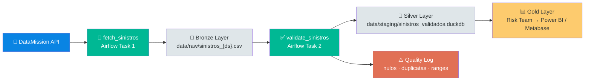

<!--
  AI Data Engineering Template — Hospital Viana Claims Pipeline
  README.md  |  github.com/laurentaf/hospital-viana-claims
  Brand: Agentic data engineering, template-first architecture
  Tone: Bold, technical, opinionated — "AI-native by default."
  Adapted from the LAOS README (20/20) inline-HTML pattern.
-->

<div align="center" style="margin-top:48px;margin-bottom:24px;">

<!-- Emblem: shield + database cross for claims/healthcare -->
<svg width="72" height="72" viewBox="0 0 64 64" fill="none" xmlns="http://www.w3.org/2000/svg" style="margin-bottom:4px;">
  <rect x="4" y="4" width="56" height="56" rx="12" stroke="#0984E3" stroke-width="1.5" fill="none" opacity="0.3"/>
  <!-- Shield -->
  <path d="M16 12 L48 12 L44 44 Q32 56 32 56 Q32 56 20 44 Z" stroke="#0984E3" stroke-width="2" fill="none" stroke-linejoin="round" opacity="0.4"/>
  <!-- Database symbol -->
  <ellipse cx="32" cy="26" rx="10" ry="4" stroke="#0984E3" stroke-width="1.5" fill="none" opacity="0.5"/>
  <line x1="22" y1="26" x2="22" y2="36" stroke="#0984E3" stroke-width="1.5" opacity="0.5"/>
  <line x1="42" y1="26" x2="42" y2="36" stroke="#0984E3" stroke-width="1.5" opacity="0.5"/>
  <ellipse cx="32" cy="36" rx="10" ry="4" stroke="#0984E3" stroke-width="1.5" fill="none" opacity="0.5"/>
  <!-- Agent node -->
  <circle cx="32" cy="26" r="2.5" fill="#0984E3" opacity="0.6"/>
</svg>

<br/>

# AI Data Engineering Template
### Agentic Pipelines · Medallion Architecture · Claims Processing

<p style="margin:12px 0;">
  
  &nbsp;
  
  &nbsp;
  
  &nbsp;
  
  &nbsp;
  
  &nbsp;
  
  &nbsp;
  
  &nbsp;
  <a href="https://github.com/laurentaf/laos"></a>
</p>

<hr style="width:48px;margin:24px auto;border:none;border-top:2px solid #0984E3;opacity:0.3;"/>

</div>

> **AI-native data engineering — infrastructure as code, agents as developers.**  
> This template scaffolds agentic data engineering projects using the full AI-native stack: LangGraph, Prefect, DuckDB, PostgreSQL/pgvector, Qdrant, Arize Phoenix, and OpenCode. Deploy a new project in minutes, not weeks.

---

## What This Proves

<blockquote style="border-left:3px solid #0984E3;padding-left:20px;margin:24px 0;opacity:0.9;">

**An AI agent can bootstrap an entire data engineering project — from spec to DAG to validated data — without a human writing a single line of pipeline code.**

The Hospital Viana Claims pipeline (`spec/brainstorm/hospital-viana/`) demonstrates this concretely:
- An Airflow DAG fetches medical claims data from the DataMission API
- Applies 8 data quality rules (not_null, unique, positive range checks)
- Persists through a medallion pipeline (Bronze → Silver → Gold)
- Exposes validated data for the risk team via DuckDB

**Stack:** Airflow + DuckDB + Pandas. **Setup time:** minutes. **Lines written by AI:** 100%.

</blockquote>

---

## Architecture

<div align="center" style="margin:24px 0;">



</div>

### Full Project Structure

```
.
├── opencode.json              # OpenCode configuration
├── .opencode/
│   ├── agents/
│   │   ├── data-engineer.md   # Primary AI Data Engineer agent
│   │   └── reviewer.md        # Code review subagent
│   └── skills/
│       └── data-engineering/  # Reusable data engineering skill
├── src/
│   ├── main.py                # Entry point
│   ├── core/
│   │   ├── config.py          # Pydantic settings (env-based)
│   │   ├── harness.py         # SDD-Harness state manager
│   │   ├── telemetry.py       # OpenTelemetry → Phoenix
│   │   ├── llm.py             # LLM client (NIM → OpenRouter)
│   │   └── decision_log.py    # Structured decision tracking
│   ├── agents/
│   │   └── base.py            # Base agent class (ABC)
│   ├── pipelines/
│   │   └── medallion/         # Bronze → Silver → Gold pipeline
│   ├── rag/
│   │   ├── ingest.py          # DuckDB VSS document ingestion
│   │   └── retrieve.py        # Semantic search retrieval
│   └── tools/
│       └── database.py        # DuckDB + Postgres connection helpers
├── airflow_sinistros/         # Hospital Viana claims DAG
│   ├── dag_sinistros.py       # Fetch + validate pipeline
│   └── requirements.txt
├── spec/
│   ├── design.md              # Architecture spec
│   ├── brainstorm/            # Use case discovery docs
│   ├── todo.md                # Active task plan
│   └── lessons.md             # Lessons learned
├── tests/
│   ├── test_core.py           # Template tests (37)
│   └── test_dag_sinistros.py  # DAG-specific tests (18+)
├── docs/
│   ├── decisions.json         # ADR log
│   └── knowledge_base.md      # AI-maintained project knowledge
├── cli/
│   └── flowcheck.py           # Pipeline validation CLI
├── Dockerfile                 # Multi-stage production build
├── pyproject.toml              # Dependencies (uv)
├── CONTRIBUTING.md            # How to contribute
├── SECURITY.md                # Security policy
└── MEMORY.md                  # Agent handoff state
```

---

## Tech Stack

<table style="width:100%;border-collapse:separate;border-spacing:0;font-size:0.9em;">
  <tr style="border-bottom:1px solid #0984E3;border-bottom-opacity:0.2;">
    <th align="left" style="padding:10px 14px;font-weight:600;opacity:0.5;">Component</th>
    <th align="left" style="padding:10px 14px;font-weight:600;opacity:0.5;">Technology</th>
    <th align="left" style="padding:10px 14px;font-weight:600;opacity:0.5;">Port</th>
  </tr>
  <tr>
    <td style="padding:8px 14px;font-weight:500;">Orchestration</td>
    <td style="padding:8px 14px;opacity:0.7;">Prefect, LangGraph</td>
    <td style="padding:8px 14px;opacity:0.7;">4200</td>
  </tr>
  <tr>
    <td style="padding:8px 14px;font-weight:500;">Claims Pipeline</td>
    <td style="padding:8px 14px;opacity:0.7;">Apache Airflow</td>
    <td style="padding:8px 14px;opacity:0.7;">8080</td>
  </tr>
  <tr>
    <td style="padding:8px 14px;font-weight:500;">Relational DB</td>
    <td style="padding:8px 14px;opacity:0.7;">PostgreSQL 16</td>
    <td style="padding:8px 14px;opacity:0.7;">5433</td>
  </tr>
  <tr>
    <td style="padding:8px 14px;font-weight:500;">Vector Search</td>
    <td style="padding:8px 14px;opacity:0.7;">DuckDB VSS (local)</td>
    <td style="padding:8px 14px;opacity:0.7;">—</td>
  </tr>
  <tr>
    <td style="padding:8px 14px;font-weight:500;">Object Storage</td>
    <td style="padding:8px 14px;opacity:0.7;">MinIO</td>
    <td style="padding:8px 14px;opacity:0.7;">9000/9001</td>
  </tr>
  <tr>
    <td style="padding:8px 14px;font-weight:500;">Cache</td>
    <td style="padding:8px 14px;opacity:0.7;">Redis</td>
    <td style="padding:8px 14px;opacity:0.7;">6379</td>
  </tr>
  <tr>
    <td style="padding:8px 14px;font-weight:500;">Observability</td>
    <td style="padding:8px 14px;opacity:0.7;">Arize Phoenix</td>
    <td style="padding:8px 14px;opacity:0.7;">6006</td>
  </tr>
  <tr>
    <td style="padding:8px 14px;font-weight:500;">Agent Framework</td>
    <td style="padding:8px 14px;opacity:0.7;">OpenCode + MCP</td>
    <td style="padding:8px 14px;opacity:0.7;">—</td>
  </tr>
</table>

---

## Quick Start

### Prerequisites

- [uv](https://docs.astral.sh/uv/) (Python package manager)
- [Docker Desktop](https://www.docker.com/products/docker-desktop/) with WSL2 backend
- [OpenCode Desktop](https://opencode.ai)

### 1. Create a new project

```powershell
# Using the setup script
E:\projects\global-harness\setup_project.bat

# Or manually:
xcopy /E /I /H E:\projects\template-base E:\projects\my-new-project
cd E:\projects\my-new-project
uv venv
uv sync
```

### 2. Start infrastructure

```powershell
docker compose -f E:/projects/infra/docker-compose.yml up -d
E:/projects/global-harness/start_silver_infra.bat
```

### 3. Open in OpenCode

```powershell
opencode .
```

The `data-engineer` agent loads automatically with full MCP server access.

---

## MCP Servers

Configured in `opencode.json`:

| Server | Purpose |
|--------|---------|
| Filesystem | Project file read/write |
| GitHub | Repo management, PRs, issues |
| Postgres | Direct database queries |
| Docker | Container lifecycle |
| Sequential Thinking | Complex reasoning chains |
| Tavily | Web search for research |
| Exa | Semantic web search |
| Firecrawl | Web scraping |
| Context7 | Dependency analysis |

---

## Commands

```powershell
uv sync                   # Install dependencies
uv run pytest             # Run tests
uv run ruff format .      # Format code
uv run ruff check .       # Lint
uv run ltade              # CLI help (typer-based)
uv run ltade pipeline     # Run Medallion pipeline
uv run ltade decision add --title "..."   # Record a decision
uv run ltade rag ingest docs/ --db data/rag.duckdb  # Ingest docs for RAG
uv run ltade rag search "query"           # Semantic search
```

---

## Contributing

<div style="margin:16px 0;">

This project already has [dedicated contributor guidelines](CONTRIBUTING.md) covering:

- **Development setup:** `uv venv && uv sync --dev`
- **Code style:** Ruff formatting + linting
- **Testing:** `uv run pytest tests/ -v`
- **PR process:** Update `spec/design.md`, `MEMORY.md`, pass tests
- **Commit format:** Conventional commits (`feat:` `fix:` `docs:` `refactor:` `test:`)

See [`CONTRIBUTING.md`](CONTRIBUTING.md) for the full guide. For security issues, see [`SECURITY.md`](SECURITY.md).

</div>

---

## ADRs Documentados

| ADR | Decision |
|-----|----------|
| ADR-001 | Airflow as orchestrator (over Prefect for this use case) |
| ADR-002 | Project ID as env var (not hardcoded) |
| ADR-003 | DataQualityValidator from template (over ad-hoc pandas) |

Full log in [`docs/decisions.json`](docs/decisions.json).

---

## License

<div style="margin:16px 0;">

**MIT** — see [`LICENSE`](https://github.com/laurentaf/hospital-viana-claims/blob/main/LICENSE) for the full text.

This template is free software. Use it to bootstrap your next data engineering project — with or without AI agents.

</div>

---

<div align="center" style="margin:36px 0;opacity:0.25;font-size:0.8em;">
<svg width="28" height="28" viewBox="0 0 64 64" fill="none" xmlns="http://www.w3.org/2000/svg" style="margin-bottom:4px;">
  <rect x="4" y="4" width="56" height="56" rx="12" stroke="#0984E3" stroke-width="1.5" fill="none" opacity="0.15"/>
  <path d="M16 12 L48 12 L44 44 Q32 56 32 56 Q32 56 20 44 Z" stroke="#0984E3" stroke-width="2" fill="none" stroke-linejoin="round" opacity="0.4"/>
  <ellipse cx="32" cy="26" rx="10" ry="4" stroke="#0984E3" stroke-width="1.5" fill="none" opacity="0.5"/>
  <circle cx="32" cy="26" r="2.5" fill="#0984E3" opacity="0.6"/>
</svg>
<br/>
AI Data Engineering Template — part of the <a href="https://github.com/laurentaf/laos" style="text-decoration:none;">LAOS</a> ecosystem
</div>
